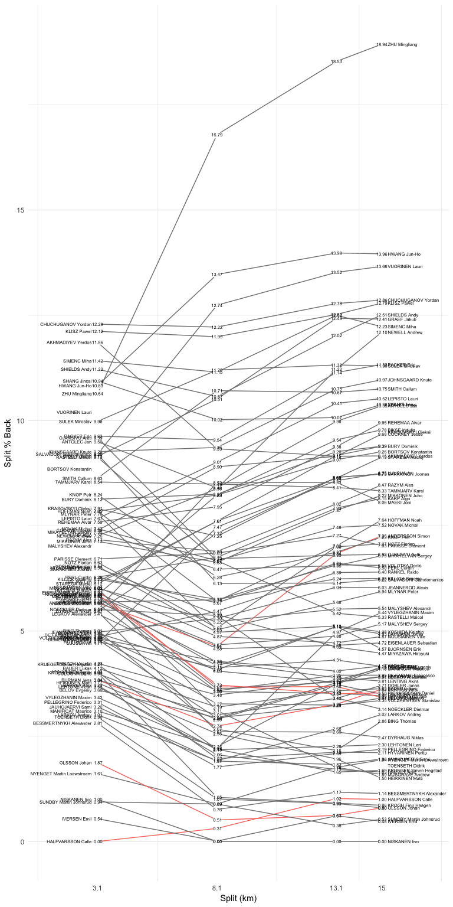
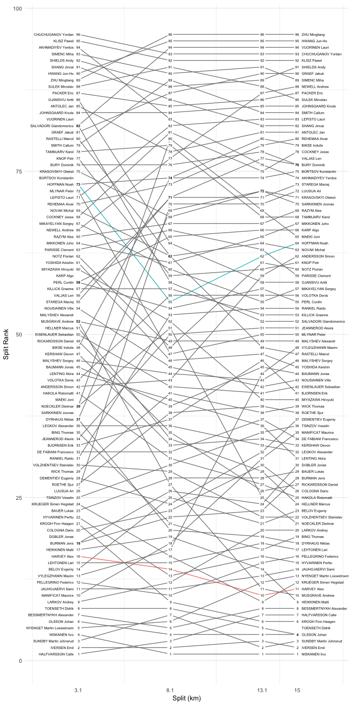
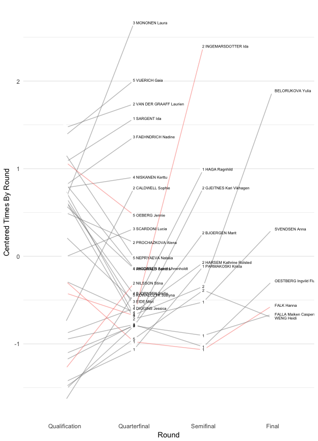
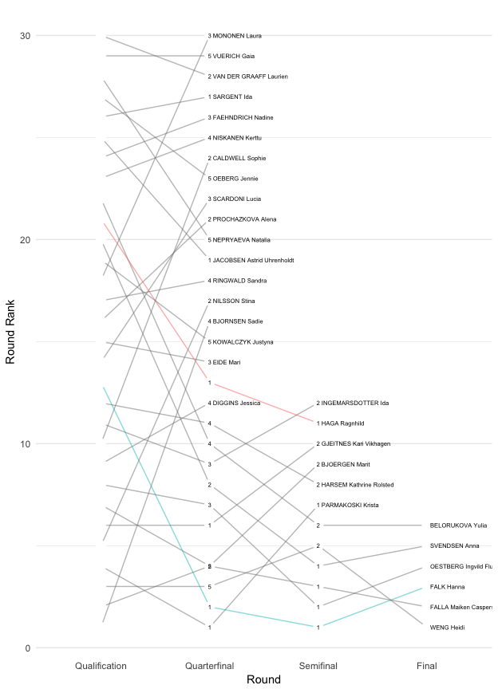

<!-- README.md is generated from README.Rmd. Please edit that file -->
fispdfparsr
===========

fispdfparsr is a collection of utilities for parsing PDF cross-country race results from [FIS](http://data.fis-ski.com). The focus initially is results from World Cups form recent seasons.

It has seen extremely limited testing and will surely break on some PDFs, since FIS likes to monkey with their formatting pretty regularly. If you find a PDF where it breaks, please file an issue.

Installation
------------

fispdfparsr uses the [tabulizer](https://github.com/ropenscilabs/tabulizer) package to do the acutal PDF parsing, which is currently available only on GitHub, not CRAN. Follow the installation instructions there first, which may involved installing some Java dependencies.

Once you have installed tabulizer, you can install fispdfparsr via:

``` r
install.packages("devtools")
devtools::install_github("joranE/fispdfparsr")
```

Usage
-----

Once the package and its dependencies are installed, we can use it as follows:

``` r
library(fispdfparsr)
#> Warning: replacing previous import 'dplyr::intersect' by
#> 'lubridate::intersect' when loading 'fispdfparsr'
#> Warning: replacing previous import 'dplyr::union' by 'lubridate::union'
#> when loading 'fispdfparsr'
#> Warning: replacing previous import 'dplyr::setdiff' by 'lubridate::setdiff'
#> when loading 'fispdfparsr'
#Some example PDFs included in fispdfparsr
dst_pth <- system.file("example_pdfs/dst_example1.pdf",package = "fispdfparsr")
spr_pth <- system.file("example_pdfs/spr_example1.pdf",package = "fispdfparsr")
```

### Distance

Note that for distance races we need to explicitly provide the race distance, since it isn't easily retreivable from the PDF.

``` r
dst <- parse_dst_pdf(file = dst_pth,race_distance = 15)
dst
#> # A tibble: 384 × 10
#>     rank   bib   fisid                   name nation fispoints split
#>    <chr> <chr>   <chr>                  <chr>  <chr>     <dbl> <dbl>
#> 1      1    21 3180535          NISKANEN Iivo    FIN      0.00   3.1
#> 2      2    58 3421320           IVERSEN Emil    NOR      3.84   3.1
#> 3      3    70 3420228 SUNDBY Martin Johnsrud    NOR      4.21   3.1
#> 4      4    25 1283892           OLSSON Johan    SWE      6.39   3.1
#> 5      4    48 3420994        TOENSETH Didrik    NOR      6.39   3.1
#> 6      6    46 3420961      KROGH Finn Haagen    NOR      6.88   3.1
#> 7      7    84 3500664      HALFVARSSON Calle    SWE      7.97   3.1
#> 8      8    62 3480695 BESSMERTNYKH Alexander    RUS      9.14   3.1
#> 9      9    56 3180053        HEIKKINEN Matti    FIN     12.03   3.1
#> 10    10    33 3220002        MUSGRAVE Andrew    GBR     12.71   3.1
#> # ... with 374 more rows, and 3 more variables: split_time <dbl>,
#> #   split_rank <int>, split_time_back <dbl>
```

The result is a data.frame with one row for each athlete at each split. This means that the values in the first 6 columns are repeated for each athlete for each split. The columns `split_time`, `split_rank` and `split_time_back` are specific to each split for each athlete.

The package includes a function to produce some simple plots. Note that choosing `type = "time"` or `type = "percent"` will likely lead to lots of overplotting of athlete's names. There only so much space on a plot.

``` r
require(ggplot2)
#> Loading required package: ggplot2
p <- dst_split_plot(data = dst,type = "percent",nation_col = "SWE")
print(p)
```



``` r
require(ggplot2)
p <- dst_split_plot(data = dst,type = "rank",name_col = c("HOFFMAN Noah","HARVEY Alex"))
print(p)
```



### Sprint

The sprint race plots focus on each round of heats. Parsing the sprint PDFs is a bit trickier, since the Java PDF parser we're relying on will silently omit blank table columns. This means that if no one in the final came from QF3, that column will be blank and the parser will simply drop it.

`parse_spr_pdf` tries to detect when this happens and prompts you to supply the index for where to insert a blank column. It should only be an issue for the final and semifinal sections of the PDF.

``` r
spr_example1 <- parse_spr_pdf(file = spr_pth)
```

The result should look like this:

``` r
data(spr_example1)
spr_example1
#> Source: local data frame [125 x 7]
#> Groups: round [9]
#> 
#>     rank   bib                      name nation      round  times ranks
#>    <int> <int>                     <chr>  <chr>      <chr>  <dbl> <int>
#> 1      1     3                WENG Heidi    NOR final_heat 195.76     1
#> 2      2     2    FALLA Maiken Caspersen    NOR final_heat 196.24     2
#> 3      3    13                FALK Hanna    SWE final_heat 197.30     3
#> 4      4     8 OESTBERG Ingvild Flugstad    NOR final_heat 200.29     4
#> 5      5    20             SVENDSEN Anna    NOR final_heat 206.56     5
#> 6      6    22          BELORUKOVA Yulia    RUS final_heat 223.31     6
#> 7      9     4         PARMAKOSKI Krista    FIN        qf1 194.57     1
#> 8      3    13                FALK Hanna    SWE        qf1 194.99     2
#> 9     10     6    GJEITNES Kari Vikhagen    NOR        qf1 195.91     3
#> 10    12    21             HAGA Ragnhild    NOR        qf1 196.96     4
#> # ... with 115 more rows
```

...a data.frame with one row for each athlete for each heat. The heats are labeled with abbreviations like `qf1` or `sf2`.

The sprint plots are a little different and focus on the progression through each round of heats, grouped by Qualification, Quarterfinal, Seminfinal and Final. Times and ranks in each group are plotted across heats (i.e. all quarter final times are compared to each other) but they are annotated so you can tell the difference between QF1, QF2, etc.

``` r
require(ggplot2)
p <- spr_heat_plot(data = spr_example1,type = "centered",nation_col = "SWE")
print(p)
#> Warning: Removed 36 rows containing missing values (geom_text).
```



``` r
require(ggplot2)
p <- spr_heat_plot(data = spr_example1,type = "rank",name_col = c("FALK Hanna","HAGA Ragnhild"))
print(p)
#> Warning: Removed 36 rows containing missing values (geom_text).
```


